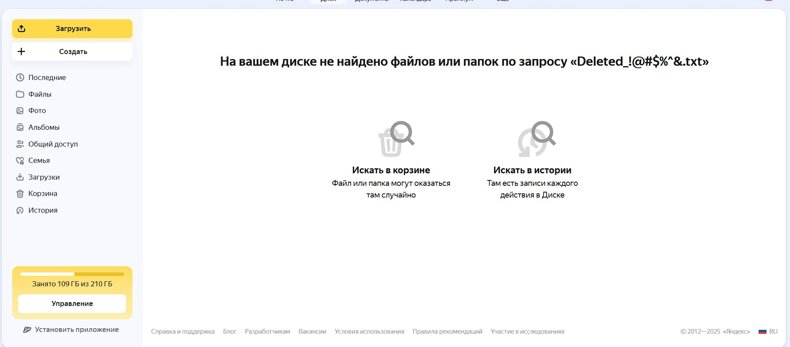

Bug Report

| Name | Value |
|--|--|
| ID | BUG-UI-001 |
| Название бага | Файл из корзины не отображается в результатах поиска |
| Дата обнаружения | 2025-04-05 |
| Тестировщик | Личинин Виталий |
| URL приложения | https://disk.yandex.ru/ |
| Окружение | Brave Browser 1.77.97, Windows 10 |
|Предусловия|- Пользователь авторизован - На диске есть файл: `Deleted_!@#$%^&.txt` - Файл `Deleted_!@#$%^&.txt` перемещён в корзину|
|Шаги воспроизведения|1. Открыть Яндекс.Диск 2. В поле поиска ввести `Deleted_!@#$%^&.txt` 3. Нажать Enter|
|Ожидаемый результат|Файл `Deleted_!@#$%^&.txt`, находящийся в корзине, должен отображаться в результатах поиска|
|Фактический результат|Файл не отображается в результатах поиска|
|Скриншоты||
|Логи||
|Severity|Medium|
|Priority|High|
|Комментарии|Согласно требованиям ([CHECK_LIST_UI](CHECK_LIST_UI.md), #5), поиск должен находить файлы независимо от их местоположения, включая корзину|
