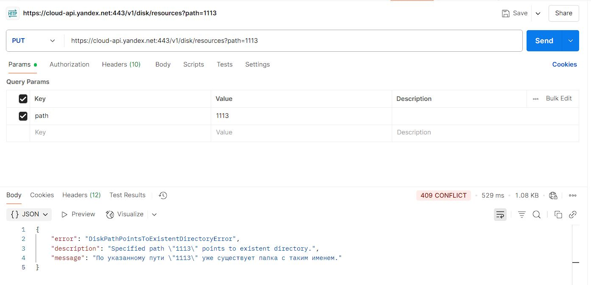

Bug Report
| Name | Value |
|--------------|-----------------------------------------------------------------------|
| ID | BUG-API-002 |
| Название бага| Сервер возвращает 409 Conflict вместо 400 Bad Request при попытке создания уже существующей папки |
| Дата обнаружения | 2025-04-05 |
| Тестировщик | Личинин Виталий |
| URL приложения | https://cloud-api.yandex.net:443/v1/disk/resources |
| Окружение | Postman v10.22, Windows 10 |
| Предусловия | - Валидный OAuth-токен - папка `1113` создана в корне диска|
| Шаги воспроизведения | 1. Отправить PUT-запрос: `https://cloud-api.yandex.net:443/v1/disk/resources?path=1113` 2. Заголовки: `Content-Type: application/json`, `Authorization: OAuth <valid_token>`|
| Ожидаемый результат |  Сервер возвращает код ответа 400 Bad Request, папка не создаётся |
| Фактический результат |  Сервер возвращает код ответа 409 Conflict, папка не создаётся |
| Скриншоты |  |
| Логи |  |
| Severity | Low |
| Priority | Medium |
| Комментарии | Согласно требованиям ([CHECK_LIST_API](../CHECK_LIST_API.md), #5), при попытке создания уже существующей папки должен возвращаться статус-код 400. Получено 409 Conflict. |